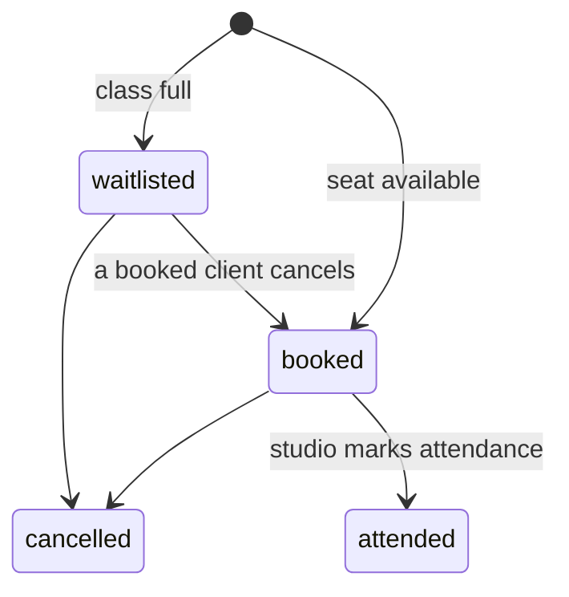
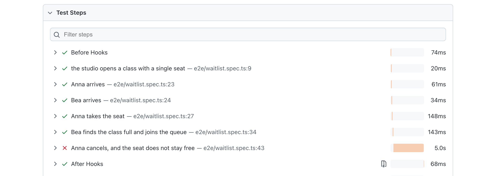
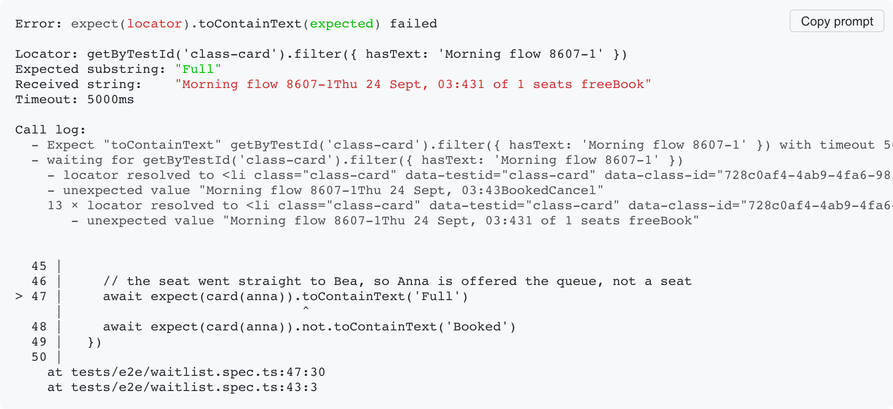
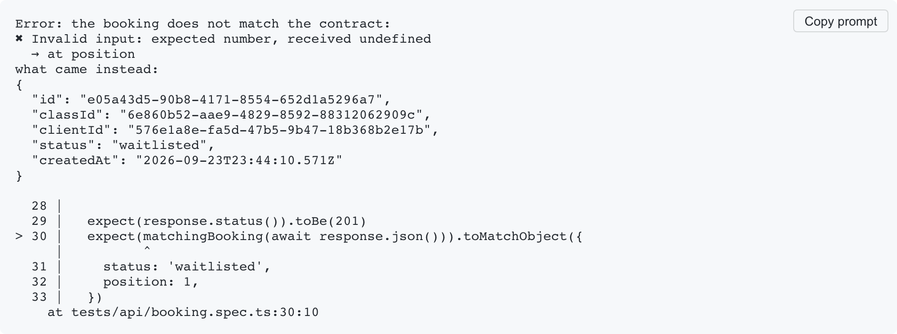

# studio-booking-qa

A small class-booking app for a yoga studio, tested at unit, API and E2E
levels with Playwright, TypeScript and vitest.

The point of this repository is the test strategy. The app is deliberately
tiny. The rules were written before any code, and the tests check the rules,
not the implementation.

Coverage is half of it. The other half is what a failure tells you, and
whether a test can fail at all. Every rule here was broken on purpose to see
which case would notice; mutation testing asks the same of the pure modules on
every push; and the reports are treated as a deliverable, not as output —
[see what a failure looks like](#what-a-failure-looks-like).

- [What the app does](#what-the-app-does)
- [Rules](#rules)
- [Rule & where it is tested](#rule--where-it-is-tested)
- [Running it](#running-it)
- [What a failure looks like](#what-a-failure-looks-like)
- [Out of scope](#out-of-scope)

The detail lives in two documents: **[requirements](docs/requirements.md)**,
down to status codes and error texts, and **[test cases](docs/test-cases.md)**,
every case and the level it runs at. The last run on `main` publishes its
**[reports](https://alisakrylova.github.io/studio-booking-qa/)** — the cases
with their steps, and what the unit tests would fail to notice.

## What the app does

A client opens the class schedule and books a class. If the class is full,
the client joins the waitlist instead of being turned away. When a booked
client cancels, the first person on the waitlist gets the seat automatically.
The studio creates classes and marks who actually came.

Two actors: a **client**, who uses the web UI and manages only their own
bookings, and the **studio**, which uses the API with a static key and has no
UI.

## Rules

- **Booking.** A free seat makes a booking `booked`; a full class puts it on
  the waitlist, first in, first out. A client cannot book the same class
  twice.
- **Cancellation.** When a `booked` client cancels, the first waitlisted
  client is promoted automatically. A waitlisted client who cancels just
  leaves the queue.
- **Started classes.** Once a class has started, it cannot be booked or
  cancelled.
- **Attendance.** Only a `booked` client can be marked as attended.



Every edge case — repeated actions, conflicting states, access and validation
— is spelled out in [the requirements](docs/requirements.md). The tests check
that document, which is why it exists before the code.

## Rule & where it is tested

Every rule is tested at the lowest level where it can fail. A higher level
only checks what the lower one cannot see.

| Rule | Unit | API | E2E | Why here |
|------|:----:|:---:|:---:|----------|
| Booking and waitlist | ● | ● | ● | Combinations are logic; the API adds status codes; E2E shows the waitlist reaching the client. |
| Cancellation and promotion | ● | ● | ● | Unit covers the combinations; the API checks the promotion over HTTP; E2E shows it reaching the other client's screen. |
| Started classes | ● | ● | — | Unit covers the `now == startsAt` boundary; one API test checks it against a real clock. |
| Attendance | ● | ● | — | No UI for attendance, so the API is the top level. |
| Validation | ● | ● | — | The boundaries are a pure function; two API tests show a route calls it, and rejects before doing any work. |
| Access | — | ● | — | Exists only in the HTTP layer. |
| What the schedule renders | ● | — | — | The render function is pure; a browser would add time, not coverage. |
| Becoming a client | — | ● | ● | The API checks the cookie it hands out; only a browser can show that the form turns a visitor into someone who can book. |

Two E2E scenarios carry all four marks: one for the waitlist, one for the way
in. Cases, counts and automation status: **[test cases](docs/test-cases.md)**.

## Running it

```bash
npm install
npx playwright install chromium

STUDIO_KEY=k npm start        # http://localhost:3000
```

The schedule is empty until the studio puts something in it, and the studio
has no screen of its own:

```bash
curl -X POST localhost:3000/classes \
  -H 'content-type: application/json' -H 'x-studio-key: k' \
  -d '{"title":"Morning flow","startsAt":"2030-01-01T10:00:00Z","capacity":1}'
```

```bash
npm test              # every level, in order
npm run test:unit     # rules, validation, rendering — no browser, no server
npm run test:api      # the HTTP contract
npm run test:e2e      # two scenarios in a browser
npm run test:smoke    # the four cases that say whether the rest is worth running
npm run test:mutation # what the unit tests would fail to notice
npm run report        # the last Playwright run, as a page
```

The same reports from CI are published at
<https://alisakrylova.github.io/studio-booking-qa/>.

Playwright starts the app itself on a port of its own, so tests never meet a
server left running on 3000.

## What a failure looks like

Every picture below comes from a real run with a rule broken on purpose.

In a browser the steps say where the story stopped: the booking and the
waitlist held, and the consequence did not.



The message says what was expected and what the page showed instead — Anna's
card offered a free seat, because the seat never reached Bea.



At the API level the subject is the contract rather than a story, so a failure
names the field, prints the body that came instead, and points at the line
that asked for it.



## Out of scope

- No pagination. A studio has only a few classes a day, so the whole schedule
  is kept in memory and shown as one list.
- No memberships, payments, notifications, recurring classes, admin roles,
  password registration.
- No check against classes in the past. The studio is trusted to enter the
  times right, which also lets a test create a class that has already started.
- No live updates. The page redraws after the client's own action; someone
  else's change shows up on reload.
- No endpoints that exist for tests: no `/reset`, no seeding, no `?now=`
  override. Tests create their own data instead, which is also what lets them
  run in parallel.
- The app is not deployed publicly, so it has no rate limiting.
