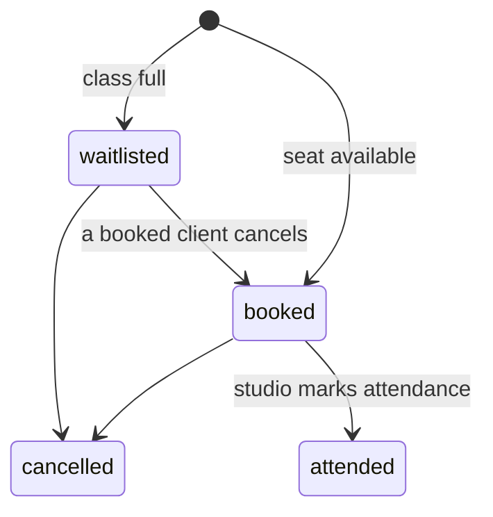

# Requirements

This document defines the behaviour the tests check, and it was written before
the code. If something is not described here, a test has no ground to expect
it. So anything a test relies on must be written here first.


- [Actors and credentials](#actors-and-credentials)
- [Entities](#entities)
- [Rules](#rules)
- [Order of checks](#order-of-checks)
- [API](#api)
- [Errors](#errors)
- [UI](#ui)

## Actors and credentials

| | Client | Studio |
|---|---|---|
| Credential | A random token from `POST /clients` | `STUDIO_KEY`, from the environment |
| Sent as | `token` cookie, `HttpOnly`, `SameSite=Strict` | `X-Studio-Key` header |

Every endpoint requires one actor or the other, except two that are open:
`POST /clients`, where a client gets its credential in the first place, and
`GET /classes` — a studio's schedule is public, and people decide whether to
identify themselves after they have seen it.

There are no passwords and no login: the cookie is the identity. It carries a
`Max-Age` of 30 days at `Path=/`, so a returning visitor still has their
bookings. Email is not unique, and there is no account recovery — a cleared
browser, another device or a server restart loses those bookings.

## Entities

**Client** — `id`, `name`, and an `email`, a `phone`, or both. A client with
no way to be contacted is invalid.

**Class** — `id`, `title`, `startsAt` (ISO 8601, UTC), `capacity`. Read
responses also carry `seatsFree`, which is `capacity − (booked + attended)`,
and `waitlistCount`, the number of waitlisted bookings, so the UI can show
whether booking will mean a seat or a place in the queue. They also carry
`myBooking`: the reader's own active booking as `{ id, status, position }`, or
`null` when there is none — and always `null` for the studio and for anyone
the server does not recognise as a client. This is where a class card gets the
client's state, so the page needs one request, not a join.

**Booking** — `id`, `classId`, `clientId`, `status`, `createdAt`. Status is
one of `booked`, `waitlisted`, `cancelled`, `attended`. `position` starts at 1
and is a number only while the booking is `waitlisted`; otherwise it is `null`.

A booking is **active** while it is `booked`, `waitlisted` or `attended`.
Cancelling makes it invisible: lists return active bookings only, so neither
`GET /me/bookings` nor `GET /classes/:id/bookings` ever shows a cancelled one.



## Rules

### 1. Booking

A free seat makes the booking `booked`. Otherwise it is `waitlisted`. The
waitlist is first in, first out, ordered by the time each client joined it.

- A client who already has an active (`booked`, `waitlisted` or `attended`)
  booking on a class cannot book it again → `409 already_booked`.
- A client who cancelled may book again. That creates a **new** booking, and
  if the class is full it goes to the end of the waitlist.

### 2. Cancellation

When a `booked` client cancels, the seat is freed and the first `waitlisted`
client becomes `booked`. Promotion is automatic and immediate.

- When a `waitlisted` client cancels, they leave the queue and nobody is
  promoted. Positions behind them shift up.
- A booking on a class that has already started cannot be cancelled →
  `409 class_started`. Otherwise promotion would book someone onto a started
  class and break rule 3.
- An `attended` booking cannot be cancelled → `409 not_cancellable`.

### 3. Started classes

A class has started when `now >= startsAt`. Booking a started class is
rejected → `409 class_started`. Cancelling is rejected by rule 2.

### 4. Attendance

Only a `booked` booking can be marked as attended. A `waitlisted` or
`cancelled` booking is rejected → `409 not_booked`. Attendance is not limited
by time: the studio may mark someone before the class starts. An attended
booking keeps its seat and still blocks a second booking on the same class.

### Repeating an action

Repeating a transition that already happened — cancelling a cancelled
booking, marking an attended booking again — returns `200` and changes
nothing.

**This check runs before the rule checks.** Cancelling an already cancelled
booking after the class has started is still a no-op, not a `409`.

### Validation

| Field | Rule |
|---|---|
| `name` | Required, 1–100 characters |
| `email` | Optional, at most 255 characters, and shaped `local@domain.tld`: exactly one `@`, nothing empty around it, and a dot inside the domain that is neither its first nor its last character. `a@b`, `a@b.` and `a@.b` are rejected |
| `phone` | Optional, 5–30 characters |
| `email` / `phone` | At least one of the two is required. If both are missing, `field` is `email` |
| `title` | Required, 1–100 characters |
| `startsAt` | Required, ISO 8601 in UTC (`2026-01-01T10:00:00Z`); an offset form is rejected. Any point in time, including the past |
| `capacity` | Required, an integer, at least 1 |

A `400` names a single `field`. When more than one field is invalid, it is the
first one in the order of the table above — client fields and class fields are
separate tables, so a class names one of its own. A body that is not an object
at all is invalid too, and names the first field of that table.

## Order of checks

1. **Credentials present and known** → else `401`. On the two open endpoints
   credentials the server does not know count as none at all — an unknown
   cookie, an unknown studio key: the schedule still answers `200` with
   `me: null`, because a restarted server must not turn a public page into an
   error
2. **Right actor for this endpoint** → else `403`
3. **Body valid** → else `400`
4. **Resource exists** → else `404`. Ids are opaque strings, so an id in an
   unexpected shape is simply unknown: `404`, never `400`
5. **Resource belongs to this client** (cancellation only) → else `403`
6. **Transition already happened** → `200`, nothing changes
7. **Rule allows the transition** → else `409`

At step 7, when two rules apply at once, the one about the booking wins over
the one about the class: cancelling an `attended` booking on a class that has
started answers `not_cancellable`, and booking a started class while holding an
active booking answers `already_booked`.

Step 5 answers `403` rather than `404`, which does tell the caller that a
booking with that id exists. Ids are random, so they cannot be enumerated,
and an explicit `403` is clearer to read. This is a deliberate trade-off.

## API

All bodies are JSON. Successful responses return the entity, or a list of
entities under `items`. Fields a request does not know are ignored: an unknown
field does not make the body invalid.

| Method | Path | Actor | Purpose | Success |
|---|---|---|---|---|
| `POST` | `/clients` | — | Create a client; sets the `token` cookie | `201` client |
| `GET` | `/classes` | — | Every class, started ones included, soonest first, with `seatsFree`, `waitlistCount` and `myBooking` | `200` items |
| `POST` | `/classes` | Studio | Create a class | `201` class |
| `POST` | `/classes/:id/bookings` | Client | Book a class | `201` booking (`booked` or `waitlisted`) |
| `GET` | `/me/bookings` | Client | Own bookings, with class details | `200` items |
| `POST` | `/bookings/:id/cancel` | Client | Cancel own booking | `200` booking |
| `GET` | `/classes/:id/bookings` | Studio | Who is booked and who is waiting | `200` items |
| `POST` | `/bookings/:id/attend` | Studio | Mark attendance | `200` booking |

A full class still returns `201`: joining the waitlist is a success, not an
error. The caller tells the two apart by `status`, not by the status code.

Shapes worth naming, because the tests declare them:

- `POST /clients` answers `{ id, name, email, phone }`. The token is **not** in
  the body — it only ever travels in the cookie, which is the point of making
  it `HttpOnly`.
- `GET /classes` answers `{ items, me }`, where `me` is `{ id, name }` for a
  recognised client and `null` for everyone else, the studio included. The
  cookie is `HttpOnly`, so the page cannot read it: `me` is the only way the
  schedule knows whether to offer actions or the identity form, and a client
  with no bookings is not mistaken for a visitor.
- `GET /me/bookings` items are a booking plus the class it belongs to, nested
  as `class`.
- `GET /classes/:id/bookings` items are a booking plus the person it belongs
  to, nested as `client` (`id`, `name`, `email`, `phone`) — the studio has to
  know who is in the room. `booked` and `attended` come first, in the order
  they were made, then `waitlisted` by position.
- Classes come back soonest first; two classes starting at the same time keep
  the order in which they were created.

## Errors

Every error response has the same shape:

```json
{ "error": { "code": "class_started", "message": "The class has already started", "field": null } }
```

`field` is set only for validation errors. **Clients pick their wording from
`code`, never from `message`**, so that rephrasing a message does not break
the UI or a test.

| Code | Status | When |
|---|---|---|
| `validation_failed` | `400` | A field breaks a validation rule; `field` says which |
| `unauthenticated` | `401` | No credentials, or credentials the server does not know |
| `forbidden` | `403` | Wrong actor for the endpoint, or someone else's booking |
| `not_found` | `404` | No such class or booking |
| `already_booked` | `409` | The client already has an active booking on this class |
| `class_started` | `409` | The class has already started |
| `not_cancellable` | `409` | The booking is `attended` |
| `not_booked` | `409` | Attendance on a booking that is not `booked` |

## UI

One page: the schedule. The UI is English, plain HTML and JavaScript, served
by the same server. Classes are listed in the order `GET /classes` returns
them; the page does not sort.

**The UI reflects state; it does not enforce rules.** A button is missing
because showing it would be meaningless, not because it protects a rule. A
request sent around the UI must still be rejected by the API — which is why
every rule is tested below the UI too.

### The class card

The schedule is visible to anyone. While `me` is `null`, the identity form sits
above it and the cards carry no actions: a visitor sees what is on and how full
it is, and identifies themselves once they want a place.

The card shows the client's own state on that class:

| The client's situation | What is shown | Action |
|---|---|---|
| `me` is `null` | `3 of 8 seats free` or `Full · 2 waiting` | none |
| No booking, seats free | `3 of 8 seats free` | `Book` |
| No booking, class full | `Full · 2 waiting`, or just `Full` when nobody is waiting | `Join waitlist` |
| Booked | `Booked` | `Cancel` |
| Waitlisted | `Waitlisted · #2` | `Leave waitlist` |
| Attended | `Attended` | none |

A class that has started is a state of the class, not of the client, so the
two add up rather than compete: the card is dimmed and there is no action at
all. The client's own status stays and gains `Started` — a booked client reads
`Booked · Started`. The seat counter does not stay: a client with no booking
reads `Started` alone, because how many seats are free no longer means
anything once the class cannot be booked.

A double booking is impossible in the UI because the button is **replaced**,
not disabled. Disabled buttons are avoided: they do not explain themselves.

The one place a button is disabled is while its own request is in flight.
Otherwise a double click sends two requests, and the second one fails with
`409` on an action that actually succeeded.

### Empty states

| Situation | Text |
|---|---|
| No classes at all | `No classes scheduled yet.` |
| No bookings | `You have no bookings yet. Pick a class above.` |
| The schedule failed to load | `Couldn't load the schedule.` plus a `Retry` button |

An empty list and a failed load must look different. A test for the empty
state has to fail if the page is showing an error instead.

### Messages

The identity form carries `novalidate`, so the browser shows none of its own
bubbles: `type="email"` stays only for the right mobile keyboard. Validation
is ours, in our wording, under the field — the browser would accept `a@b`, and
it has no way to express "an email or a phone". Either way this is convenience,
not the rule: the server validates on its own.

Form errors appear under the field, on submit. Action errors appear as a
toast, and the card refreshes to the state the server reports.

| Trigger | Text |
|---|---|
| `name` missing | `Enter your name` |
| No email and no phone | `Enter an email or a phone number so the studio can reach you` |
| `email` malformed | `This doesn't look like an email address` |
| `name` longer than 100 | `Use 100 characters or fewer` |
| `email` longer than 255 | `Use 255 characters or fewer` |
| `phone` shorter than 5 or longer than 30 | `Enter a phone number of 5 to 30 characters` |
| `class_started` | `This class has already started.` |
| `already_booked` | `You're already on the list for this class.` |
| `not_cancellable` | `The studio has already marked you as attended.` |
| `not_found` on a class | `This class is no longer available.` |
| `not_found` on a booking | `This booking no longer exists.` |
| `unauthenticated` | `Your session has ended. Enter your details again.` and the identity form reappears |
| `forbidden` | `You can't do that.` |
| Network failure or `5xx` | `Something went wrong. Please try again.` |

### A stale screen is not an error

The page never refreshes itself: there is no polling and no push. It redraws
after the client's own action, from the response, and changes made by anyone
else appear only after a reload. A screen is therefore expected to be out of
date, and the cases below are normal outcomes rather than failures:

- The last seat was taken while the page was open. `Book` then returns
  `201 waitlisted`, and the UI says
  `The class filled up — you're #2 on the waitlist.` That is a different
  outcome, not a failure.
- The booking was already cancelled in another tab. `Cancel` returns `200`
  unchanged and the card silently refreshes.

### How tests find things

Ordinary elements are found by role and accessible name, for example
`getByRole('button', { name: 'Book' })`. Class cards carry
`data-testid="class-card"` and `data-class-id`, because they repeat and look
alike.
